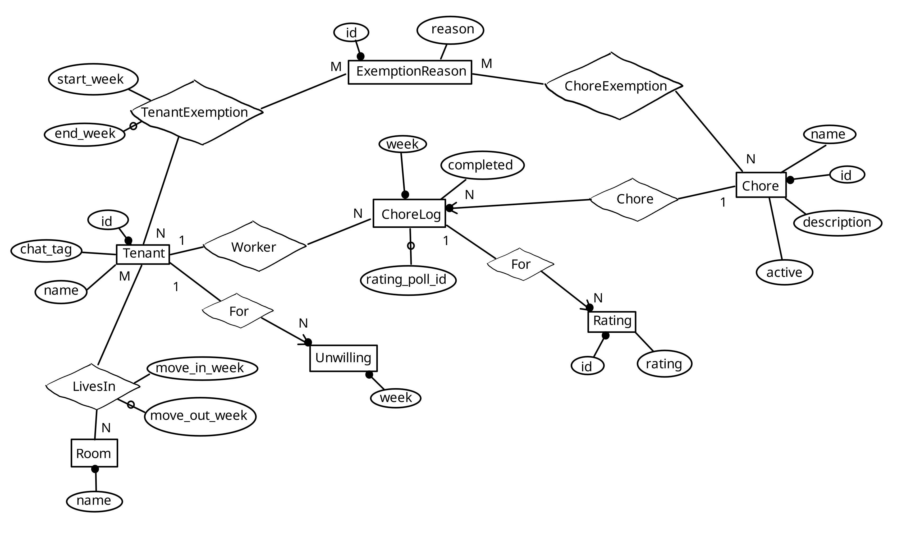

# chore_planner
Chat Bot scheduling your Shared Apartment's Chores.

Simply add it to your group chat to have an
- **unintrusive** (no one has to install an app, create an account or even open a website),
- **easy to administrate** (with an easy to use chat command interface),
- **platform-independent** (implementing other chats than Telegram is easy) and
- **privacy friendly** (your data is stored on your server and nowhere else)

way of handling your chores.

The chore_planner supports complex chore and exemption structures **fairly** assigning tenants in a way you can **trust**.

# Weekly Action
https://github.com/user-attachments/assets/e46e64ad-d43b-473f-8171-3fdebad0fc38

Here you see the three messages the chore_planner sends at the start of each week:
1. This week's assignments (I.e., who needs to do what in the new week?)
2. Poll for rating how the last week went
3. Future assignment plan

# Administration
https://github.com/user-attachments/assets/6dcd56ed-f12b-4f27-b1aa-13ba824b1b40

And here is what you need to do once the bot is [running on your server](#deployment-and-config).
The entire administration can be performed from the comfort of your chat.
Send `@name_of_your_bot --help` for an overview over all commands.

There are more things you can change that aren't implemented in the chat administration yet.
You can perform those directly on the SQLite Database using the [SQLiteBrowser](https://sqlitebrowser.org) or similar tools.
When the chore_planner boots up it checks the database integrity and explains if your changes have broken something.

# Chores
A possible **chore** could be the "Dishwashing Duty" / "Spüldienst", which involves emptying the dishwasher for a week.

You can define as many **chores** as you like, each with their own name and description.
A **chore** is some task one **tenant** performs for one week.
The chore_planner assigns a **tenant** for each **chore** for each week (See [ChoreLog Assignment](#chorelog-assignment)).

If some job is to be done by two tenants, simply split it into two chores.

# Exemptions
If, for example, the **tenant** "Hanna" is the "Minister of Beverages" they can be exempt from certain **chores**, say the "Dishwashing Duty".

In this case "Minister of Beverages" is the **exemption reason** currently granted to "Hanna" and applied to the "Dishwashing Duty".

# Rooms and Tenants
The **tenant** "Hanna" might live in the **room** "M405".

**Tenants** having moved into a **room** and haven't moved out yet are called **current tenant**.
A **tenant** can change her **room** by moving out of her current **room** and immediately moving into a new **room**.

# ChoreLog Assignment
The "Dishwashing Duty" on week "32/2024" is an example **ChoreLog**.
When "Hanna" performs this **ChoreLog** everyone on her flat profits from that.
The chore_planner needs to remember this.

To achieve a fair and flexible **ChoreLog** assignment every **tenant** has a score.
In the example above the chore_planner rewards "Hanna" by increasing her score by `1`.
Everyone else's score is reduced by `1/(N-1)` with `N` being the number of profiting **tenants**.

The chore_planner randomly chooses a **tenant** for the **ChoreLog**, each with their own probability.
Low scores imply the **tenant** didn't do their chores often enough and are thus punished with a higher probability of being chosen.
High scores reduce the **tenant**'s probability.
How drastically the chore_planner punished negative scores is affected by the **gamma** value in the [config](#deployment-and-config).

Exempt tenants, unwilling tenants and tenants not living in a room are not considered.

There is a [(german) mathematical explanation](docs/probability_distribution.pdf) of the chore_planner's probability distribution.

# Unwilling Tenants
Say the "Dishwashing Duty" on week "32/2024" was assigned to "Hanna" as usual.
But this week her parents are coming over and she doesn't have the time to do the chore.
"Hanna" can use the `replan` command to mark herself **unwilling** for that week.

Unwilling tenants won't be considered for assignment.
But "Hanna" is still profiting from someone else doing the chore so her score is reduced.
Henceforth, she has a higher probability of being chosen in the following weeks.

This is the difference between unwilling tenants and (temporarily) moved out tenants.
The latter aren't profiting from done chores.

# ChoreLog Rating and History
At the end of a week the chore_planner asks all tenants to rate how the last week went.
Therefore we don't forget that "Hanna" did a terrible job at the "Dishwashing Duty" last week.

These ratings have no effect on the **ChoreLog** assignment.
But once or twice a year you might want to use the `report` command to get an overview over the past weeks.
Maybe you can think of nice rewards for those doing a good job.

# Deployment and Config
Though you can host the chore_planner directly on your server, the easier approach is a Docker Compose deployment.
See [the example docker-compose.yml](example_deployment/docker-compose.yml) for an explanation of all configuration options.
This uses the [docker_cron container](https://github.com/christopher-besch/docker_cron) to send a [SIGHUP](https://en.wikipedia.org/wiki/SIGHUP) to trigger the [weekly action](#weekly-action).

To test the chore_planner [create a telegram bot](https://core.telegram.org/bots), disable [the bot's privacy mode](https://core.telegram.org/bots/features#privacy-mode) and start the chore_planner with `TELEGRAM_CHAT_ID=your_id TELEGRAM_BOT_TOKEN=your_token docker compose up` in the example_deployment directory.
You can figure out your chat's id by setting a random value, sending some message to your chat and looking at the chore_planner's log.

For an ansible setup see [github.com/christopher-besch/docker_setups](https://github.com/christopher-besch/docker_setups/tree/main/ansible/playbook/roles/docker_chore_planner).

# Database Structure
All data is stored in the database removing the risk of crashes.

### EER Model in Standard Cardinality

The database scheme uses both ids and unique names for most relations.
That way the name of e.g., a **tenant** can easily be changed while letting the application use names for indexing.

All relations are normalized making changes easy.
More high level concepts are implemented using SQL views.

For example the **tenant** scores are implemented in the TenantScore view.
Instead of storing the scores directly they are calculated every time they are needed.
This creates a single source of truth.

# Extensibility
Though only Telegram is supported for now, the chore_planner is designed with extensibility in mind.
A new chat integration like Discord or Matrix only needs to implement the `MessagableBot` and optionally the `PollableBot` trait from src/bot.rs.

# Testing
The entire database interaction written in SQL is thoroughly unit tested.
This ensures the SQL statements do what they're designed to do.
